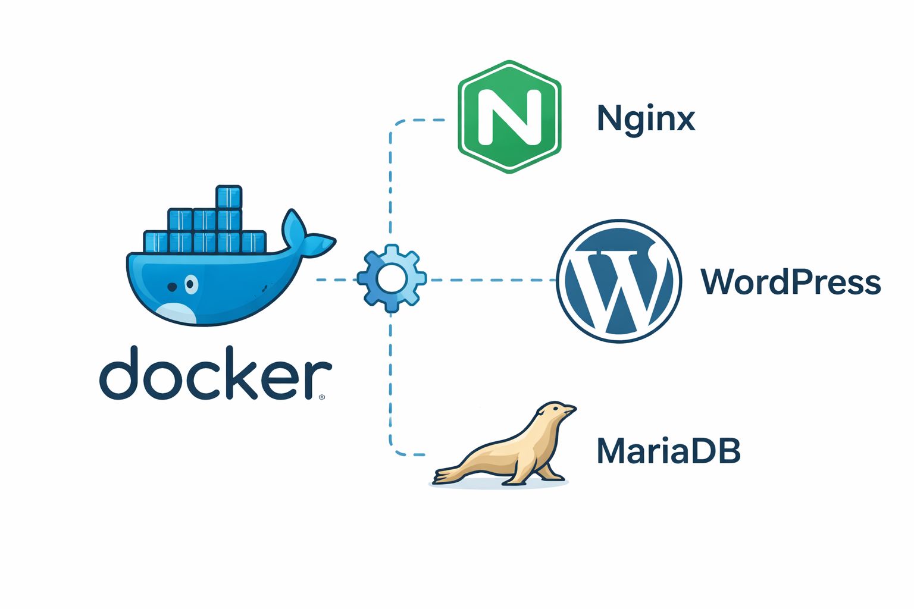

# Inception

Docker-based infrastructure project from **42 School**.

The goal is to set up a complete web stack using **Docker and Docker Compose**, where each service runs in its own container and communicates through a custom Docker network.

<div align="center">
  
</div>
---

## Architecture

- **Nginx** – Reverse proxy (TLS)
- **WordPress** – PHP-FPM application
- **MariaDB** – Database
- **Docker Compose** – Service orchestration
- **Custom Docker images** – No pre-built images

Each service runs in a **dedicated container**.

---

## Mandatory Services

- Nginx (TLS enabled)
- WordPress + PHP-FPM
- MariaDB
- Volumes for persistent data
- Custom Docker network

---

## Bonus

- Redis (WordPress caching)
- FTP server
- Adminer
- CAdvisor
- Static website (optional)

---

## Technologies

- Docker / Docker Compose
- Nginx
- WordPress
- MariaDB
- Redis
- Linux (Debian)
- Bash scripting

---

## Usage

```bash
make
